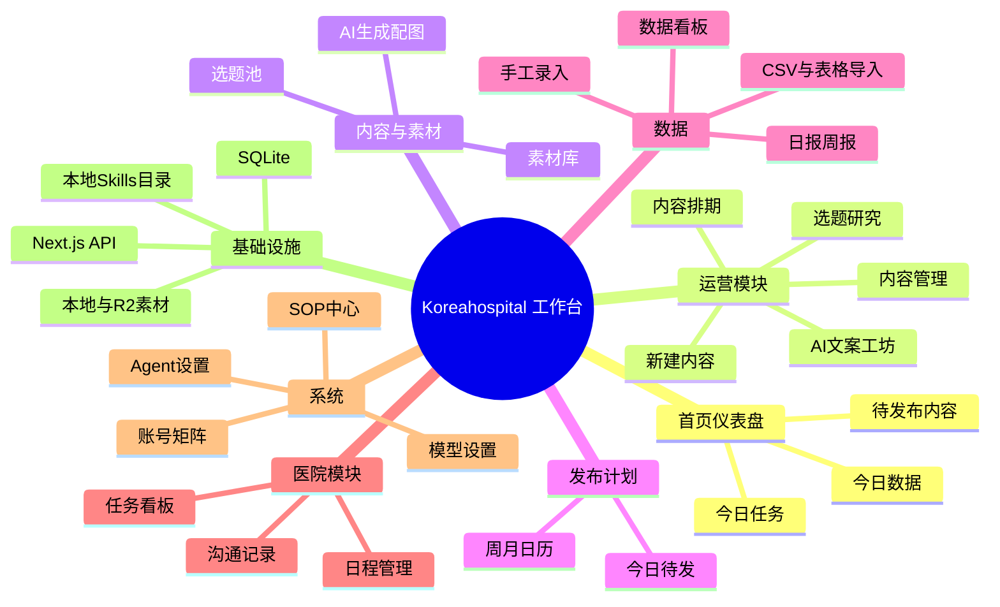
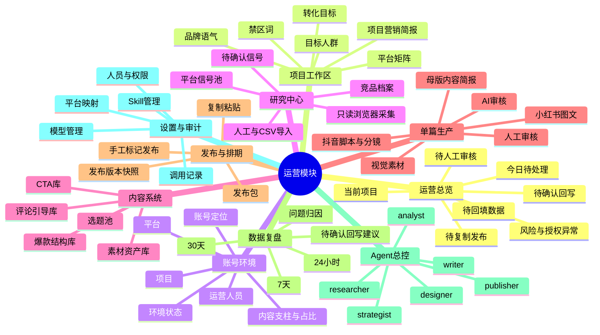
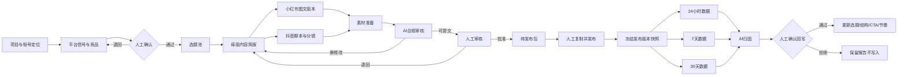

# Koreahospital 社媒营销工作台 PRD

> 版本：1.0
> 日期：2026-09-01
> 状态：产品决策已确认，待实施
> 仓库：[github.com/boboni-cell/Koreahospital](https://github.com/boboni-cell/Koreahospital)
> 产品形态：当前单项目、单运营人员；底层支持未来多项目、多人员

## 1. 产品摘要

Koreahospital 工作台将从“账号、内容、素材、排期和数据等功能页面的集合”，升级为一套以项目为上下文、以内容生产状态为主线、以发布复盘回写为闭环的社媒营销工作区。

首版服务 Koreahospital 一个项目，由一名运营人员长期使用；其他成员目前以查看为主。底层模型预留多项目、多人员和国内外多平台能力。首版必须同时支持小红书和抖音的内容生产与人工发布闭环，其他平台注册但处于“规划中”。

系统不接管平台账号，不自动发布、评论、点赞或绕过平台风控。Publisher Agent 只生成可复制的发布包、完成发布前检查，并等待运营人员手工发布后回填结果。

## 2. 背景与现状

### 2.1 已有能力

- Next.js App Router + SQLite + Tailwind 工作台。
- 账号矩阵、内容管理、AI 文案工坊、选题研究、素材库、排期、今日待发、数据录入和日/周报。
- 真实数据手工录入、CSV/表格粘贴、字段映射、上传记录和账号日期幂等写入。
- 标记已发布、内容数据回填和报表汇总。
- 多模型配置与一键切换。
- 本地 `skills/<slug>/SKILL.md` 扫描、模型动态选择和正文注入。
- `medical-compliance` 作为常驻医疗合规 Skill。
- 已注册小红书、抖音、TikTok、Instagram、YouTube、微博、微信公众号、视频号、Naver 九个平台。

### 2.2 当前结构性问题

- 页面按功能划分，但缺少统一项目上下文和端到端运营主线。
- `accounts` 仅有平台、账号、角色、粉丝和状态，缺少项目、账号定位、内容支柱和运营人员。
- 选题、内容、发布快照和复盘结论没有形成稳定的可追溯关系。
- 缺少竞品档案、平台信号池、爆款结构库、CTA/评论引导库。
- Agent 能选择 Skill，但还没有 researcher、strategist、writer、designer、publisher、analyst 的角色交接协议。
- AI 审核、人工审核、退回原因和批准证据没有独立记录。
- 当前没有登录、只读权限或操作审计；在对外共享网址前存在数据修改风险。
- 当前 Skill 机制是提示词注入，不会自动执行外部仓库附带的浏览器脚本或 CLI。

## 3. 产品目标

### 3.1 核心目标

1. 在同一运营工作区管理项目定位、目标人群、平台矩阵、竞品、素材、内容和数据。
2. 将账号定位、内容策略、单篇生产、审核、人工发布、复盘和知识回写串成一条可追踪流程。
3. 让六个角色 Agent 在同一份项目事实和工作状态上协作，减少重复输入。
4. 首版跑通小红书图文与抖音短视频两个平台的完整闭环。
5. 让系统明确告诉单人运营者“下一步该处理什么”，而不是只展示功能入口。
6. 保留每次发布使用的选题、结构、文案、素材、模型、Skill 和审核结果，用于可靠归因。

### 3.2 非目标

- 首版不自动登录平台。
- 首版不自动发布、评论、点赞、收藏或私信。
- 不绕过验证码、平台频率限制或反自动化策略。
- 不自动抓取非公开数据或保存普通用户敏感信息。
- 首版不建设完整的多租户 SaaS、计费和复杂组织权限。
- 不为九个平台分别复制一套工作台。
- AI 不拥有最终发布批准权，也不能直接改写正式知识库。

## 4. 已确认的产品原则

1. **多项目底座，单项目首发**：当前默认 Koreahospital，未来可新增项目。
2. **单运营模式优先**：运营人员默认是当前使用者，界面不重复要求选择自己。
3. **流程位于运营模块**：不替换现有首页仪表盘；在“运营”模块内提供流程型工作区。
4. **角色 Agent，平台 Skill**：按岗位划分 Agent，按平台叠加规则与 Skill。
5. **母版简报，多平台派生**：事实和策略维护一次，各平台生成独立版本。
6. **AI 初审，人工终审**：只有人工批准才能进入待发布。
7. **人工发布**：系统生成发布包，运营人员复制粘贴并手动标记已发布。
8. **证据优先**：信号、研究、审核和复盘结论必须可追溯。
9. **建议回写**：AI 只能生成待确认回写建议，人工确认后才更新知识库。
10. **保留现有数据**：通过增量迁移扩展，不重建数据库。
11. **Skill 静默运行**：业务页面不展示 Skill 选择过程；设置和审计中可查看来源与版本。
12. **医疗合规优先**：医疗合规规则覆盖平台增长建议。

## 5. 用户与权限

### 5.1 首版用户

| 用户 | 需求 | 首版权限 |
|---|---|---|
| 运营人员 | 完成研究、生产、审核、发布记录和复盘 | 全部运营操作 |
| 查看者 | 查看部分模块和结果 | 当前暂不实现账号权限；共享网址前必须补只读登录 |
| AI Agent | 生成、检查、建议和交接 | 不能最终批准、发布或直接写入正式知识库 |

### 5.2 未来角色

- 查看者：只读指定项目和模块。
- 审核者：可以人工批准或退回内容。
- 运营者：可以编辑、排期、回填和提交审核。
- 管理员：管理项目、人员、模型、Skill 和权限。

> 安全门槛：如果工作台通过局域网或公网供其他人打开，登录和只读权限必须在分享前实施，不能继续依赖无鉴权 API。

## 6. 平台范围

| 平台 | 首版状态 | 首版能力 |
|---|---|---|
| 小红书 | 必须可用 | 信号、选题、图文生产、审核、发布包、回填与复盘 |
| 抖音 | 必须可用 | 信号、脚本、分镜、素材要求、审核、发布包、回填与复盘 |
| TikTok | 规划中 | 平台注册与 Skill 占位 |
| Instagram | 规划中 | 平台注册与 Skill 占位 |
| YouTube | 规划中 | 平台注册与 Skill 占位 |
| 微博 | 规划中 | 平台注册与 Skill 占位 |
| 微信公众号 | 规划中 | 平台注册与 Skill 占位 |
| 视频号 | 规划中 | 平台注册与 Skill 占位 |
| Naver | 规划中 | 平台注册与 Skill 占位 |

## 7. 信息架构

### 7.1 当前工作台架构思维导图



### 7.2 目标运营工作区架构思维导图



### 7.3 端到端流程



## 8. 五阶段产品需求

### 8.1 阶段一：搭建社媒营销工作区

#### 功能

- 创建并选择当前项目，首版默认 Koreahospital。
- 维护项目营销简报：营销对象、目标人群、主阵地、品牌语气、转化目标、禁区词。
- 统一展示平台矩阵、账号环境、竞品、素材、内容管线和数据状态。
- 在运营模块内增加运营总览，不改现有首页仪表盘。

#### 账号环境固定字段

| 字段 | 说明 |
|---|---|
| 项目 | 所属营销项目 |
| 平台 | 小红书、抖音等平台注册项 |
| 账号定位 | 医院官方号、院长IP号、案例见证号、海外获客号等主要定位 |
| 运营人员 | 当前负责该账号的人；首版默认当前运营者 |
| 环境状态 | 配置中、可用、暂停、登录失效、风险限制、已归档 |

账号本身仍有独立账号名称、handle 或平台 ID。一个账号只有一个主要定位，但可以绑定多个内容支柱及目标占比，例如院长日常、科普、案例、医院环境、术后护理和热点回应。

### 8.2 阶段二：整理账号基础文档

#### 产物

- 项目营销简报。
- 账号定位卡。
- 平台分工表。
- 内容支柱与发布比例。
- 合规禁区词和需要证据的高风险表述。

#### 账号定位卡字段

- 账号定位和价值承诺。
- 目标人群和典型问题。
- 内容支柱与占比。
- 语气、视角和品牌露出规则。
- 主要 CTA 和转化目标。
- 禁区词、高风险话题和证据要求。
- 平台差异和发布频率。

### 8.3 阶段三：搭建社媒内容系统

#### 平台信号池

- 支持人工填写、URL收藏和 CSV 导入。
- 支持人工触发的只读浏览器采集当前公开页面。
- 不自动登录、不处理验证码、不无人值守批量爬取。
- 每条信号记录平台、来源 URL、采集时间、标题、证据摘要和状态。
- 新信号先进入“待确认”，人工确认后才能进入选题池或结构库。

#### 内容知识库

- 选题池：主题、受众问题、来源、适用平台、内容类型和证据。
- 爆款结构库：钩子类型、信息结构、适用平台、来源案例和观察时间。
- CTA库：动作目标、适用阶段、适用平台和禁用场景。
- 评论引导库：互动目标、适用内容、合规限制。
- 竞品档案：账号定位、内容支柱、结构特点、可验证表现和差异机会。
- 素材资产库：普通素材和敏感医疗素材分级管理。

AI 可以提出新增或修改建议，但必须经人工确认后进入正式知识库。

### 8.4 阶段四：进入单篇生产

#### 内容单位

```text
选题 → 母版内容简报 → 平台内容版本 → 发布版本快照
```

母版简报保存事实、目标、核心信息、证据和转化目标。平台版本分别保存标题、正文或脚本、结构、CTA、视觉方案和平台要求。

#### 总状态机

```text
选题 → 简报 → 制作中 → AI审核 → 人工审核
→ 待发布 → 已发布 → 待复盘 → 已复盘
```

- Agent 的岗位不写入内容总状态，使用当前处理角色和任务记录表示。
- 审核不通过统一退回“制作中”，保留退回原因和历史版本。
- AI 审核结果：可提交人工、需要修改、高风险需证据、禁止发布。
- 只有人工审核可以产生“已批准、待发布”。

#### 发布前检查

- 标题或开头有明确钩子，但不得夸大医疗效果。
- 信息逐层递进，核心事实有来源。
- 品牌或医生露出自然。
- CTA 和评论引导明确且合规。
- 平台格式、尺寸、时长和素材齐全。
- 敏感医疗素材授权完整。
- AI 审核和人工审核均已完成。

### 8.5 阶段五：发布、复盘与回写

#### 发布

- Publisher 生成标题、正文/脚本、话题、素材顺序、发布时间建议和检查清单。
- 运营人员复制粘贴到平台并手工发布。
- 系统不保存平台密码，不自动执行发布。
- 标记已发布时冻结发布版本快照。

#### 转化漏斗

```text
曝光 → 内容互动 → 主页访问/链接点击 → 私信或咨询
→ 有效线索 → 预约到院 → 手术成交
```

首版重点录入平台指标，以及私信/咨询、有效线索和预约数量。手术成交只保存汇总数量，不关联患者身份。

#### 复盘窗口

- 24小时：标题、封面、首轮分发和初始互动。
- 7天：内容价值、互动质量和平台推荐。
- 30天：长尾搜索、咨询和最终转化。
- 数据不足时允许标记“暂不下结论”。

#### 归因类型

- 选题问题。
- 钩子或封面问题。
- 表达和信息结构问题。
- CTA或转化路径问题。
- 素材或制作问题。
- 发布时间和执行问题。
- 平台或账号环境问题。
- 数据不足，无法判断。

AI 输出待确认回写建议，包含依据数据、影响范围和预期改进。人工确认后才能更新选题池、结构库、模板、CTA库或发布节奏。

## 9. Agent 协作架构

| Agent | 输入 | 输出 | 禁止动作 |
|---|---|---|---|
| researcher | 项目简报、平台、公开信号、竞品 | 带来源的研究包和待确认信号 | 将推测标记成平台事实 |
| strategist | 项目简报、研究包、历史复盘 | 账号定位、内容支柱、选题优先级、母版简报 | 绕过证据与合规约束 |
| writer | 母版简报、平台规则、账号语气 | 小红书文案或抖音脚本、标题、CTA | 自行发布或虚构医疗事实 |
| designer | 内容版本、素材授权、平台规格 | 封面方案、配图计划、分镜和素材清单 | 使用未授权患者素材 |
| publisher | 已批准版本、账号环境、排期 | 可复制发布包和发布前检查 | 登录、自动发布、自动互动 |
| analyst | 发布快照、24h/7d/30d数据 | 归因报告和待确认回写建议 | 直接修改正式知识库 |

总控 Agent 负责分配任务、加载模型与 Skill、检查前置状态和生成交接记录。首版只有一名运营人员，因此不模拟多个虚拟员工；系统只展示当前处理角色和需要用户确认的事项。

每次交接至少保存：项目、平台、账号环境、内容 ID、当前版本、当前角色、下一角色、处理结果、证据、时间和退回原因。

## 10. 模型与 Skill 管理

### 10.1 运行规则

- 业务页面静默自动选择模型和 Skill，不弹出技术选择过程。
- 设置页展示模型、Skill、来源、版本、许可证、启用状态和平台映射。
- 后台记录每个发布版本使用的模型、Skill 和时间，供审计与排错。
- Skill 只提供知识或流程规则；浏览器采集属于独立连接器。
- 外部脚本不能因为模型选择了某个 Skill 就自动执行。
- `medical-compliance` 始终加载，并优先于增长类建议。
- 模型调用失败时明确提示，不伪装成模型已完成。

### 10.2 GitHub Skill 候选

以下数据于 2026-09-01 通过 GitHub 仓库元数据核对；星数会随时间变化。

| 仓库 | Stars | License | 适用能力 | 采用建议 |
|---|---:|---|---|---|
| [coreyhaines31/marketingskills](https://github.com/coreyhaines31/marketingskills) | 46,293 | MIT | 产品营销、用户研究、竞品、内容策略、社媒、分析、增长闭环 | 优先选择性引入缺失方法论 |
| [white0dew/XiaohongshuSkills](https://github.com/white0dew/XiaohongshuSkills) | 3,379 | MIT | 小红书搜索、内容数据、发布和互动自动化 | 仅参考或作为隔离连接器候选，不接发布互动 |
| [autoclaw-cc/xiaohongshu-skills](https://github.com/autoclaw-cc/xiaohongshu-skills) | 1,843 | MIT | 模块化的小红书研究、内容、发布与互动 | 可评估只读研究模块；不要与上一个重复接入 |
| [vivy-yi/xiaohongshu-skills](https://github.com/vivy-yi/xiaohongshu-skills) | 406 | 未明确 | 大量小红书运营 Skill | 仅作研究参考；许可证和指标依据未解决前不复制 |
| [zJay26/douyin-skills](https://github.com/zJay26/douyin-skills) | 52 | MIT | 本地优先的抖音浏览器流程 | 抖音领域暂无真正高星成熟候选；只做隔离试验和规则参考 |

#### 首批建议引入的 `marketingskills` 子集

- `product-marketing`
- `customer-research`
- `competitor-profiling`
- `content-strategy`
- `social`
- `analytics`
- `marketing-loops`

项目已有多项小红书定位、选题、标题、写作、评论和分析 Skill，因此不直接加入重复的 copywriting Skill。引入前必须逐份审核、去重，并在项目内记录上游仓库、提交版本、许可证和本地修改。

#### 平台专项策略

- 小红书：优先复用现有本地 Skill，补充平台信号研究缺口；自动发布和互动保持关闭。
- 抖音：根据项目实际流程编写最小的平台内容规则 Skill；`zJay26/douyin-skills` 只作为浏览器边界与状态校验参考。
- 其他平台：只保留平台注册项和 Skill 映射占位，接入时遵循同一角色协议。

## 11. 核心数据模型要求

以下是概念模型，实施时应尽量复用已有表并通过增量迁移扩展。

| 实体 | 关键字段 |
|---|---|
| projects | name, status, marketing_brief, audience, voice, conversion_goal, banned_terms |
| operators | name, responsibility, status；首版不含登录凭据 |
| account_environments | project_id, platform, handle, positioning, operator_id, environment_status |
| content_pillars | project_id, name, description |
| account_pillars | account_id, pillar_id, target_ratio |
| competitors | project_id, platform, account, positioning, evidence, observed_at |
| signals | platform, source_url, captured_at, evidence, status, confirmed_by |
| structures | platform, hook_type, structure, source_signal_id, status |
| cta_items | platform, funnel_stage, text, restricted_scenarios, status |
| content_briefs | topic_id, project_id, audience, objective, facts, evidence, compliance_notes |
| content_variants | brief_id, platform, account_id, format, content, workflow_status |
| reviews | variant_id, reviewer_type, result, reasons, evidence, created_at |
| publish_snapshots | variant_id, content_version, assets, model, skills, published_at |
| metric_snapshots | publish_id, window, platform_metrics, business_metrics, observed_at |
| analyses | publish_id, diagnosis, confidence, evidence, insufficient_data |
| writeback_proposals | analysis_id, target_library, change, reason, status, confirmed_by |
| workflow_actions | object_type, object_id, actor_type, actor_id, action, from_status, to_status |

### 11.1 素材分级

#### 普通素材

医院环境、普通 Vlog、设备空镜和通用科普素材不要求患者授权档案，但仍记录基本来源和版权状态。

#### 敏感医疗素材

患者照片、术前术后图、诊疗过程、病例信息和可识别患者的素材必须记录：

- 患者编号，不存展示姓名。
- 授权状态、范围和到期时间。
- 允许的平台和禁止用途。
- 是否允许 AI 编辑。
- 已被哪些内容使用。

分类采用“AI 建议 + 上传者确认”。无法判断时按敏感素材处理。授权不完整时禁止进入待发布。

## 12. 运营模块页面要求

不修改当前首页仪表盘。运营模块增加流程型入口：

1. **运营总览**：当前项目、今日待处理、待人工审核、待复制发布、待回填、风险异常、待确认回写。
2. **项目与账号**：项目简报、平台矩阵、账号定位卡、内容支柱。
3. **研究中心**：信号池、竞品档案、待确认信号。
4. **内容系统**：选题、结构、CTA、评论引导和素材。
5. **单篇生产**：母版简报、平台版本、素材准备和审核。
6. **发布与排期**：发布包、日历、已发布记录。
7. **数据复盘**：24小时/7天/30天回填、归因和回写建议。
8. **设置**：模型、Skill、平台映射、人员和审计。

## 13. 非功能要求

### 13.1 数据安全

- 任何数据库迁移前备份 `data/clinic.db`。
- 不删除或覆盖现有账号、内容、选题、素材和指标。
- 密钥只保存在服务端配置，不进入浏览器、日志、PRD 或 Git。
- 共享工作台前必须启用登录和只读权限。
- 不保存第三方平台账号密码。

### 13.2 可追溯性

- 状态变化、审核、发布标记、数据回填和知识回写均保留操作记录。
- 发布快照冻结，不因后续编辑内容而改变。
- 平台信号必须保留来源与采集日期。
- AI 结论必须区分事实、推断和数据不足。

### 13.3 易用性

- 单人模式不重复选择运营人员。
- 业务页面不展示模型和 Skill 技术细节。
- 运营总览围绕“下一步动作”排序。
- 平台差异由 Skill 和配置处理，不复制整套页面。

## 14. MVP 验收标准

第一版必须分别为一个小红书账号和一个抖音账号完成以下真实闭环：

1. 建立项目和账号定位。
2. 设置多个内容支柱及目标占比。
3. 手工或只读采集一条带来源的平台信号。
4. 人工确认信号并进入选题池。
5. 生成一份母版内容简报。
6. 生成对应平台内容：小红书图文、抖音脚本与分镜。
7. 关联普通或敏感素材；敏感素材授权缺失时必须拦截。
8. 完成 AI 合规审核和人工审核。
9. 生成可复制发布包，不触发自动发布。
10. 人工发布并在系统标记已发布，冻结版本快照。
11. 回填 24小时、7天和30天数据。
12. AI 对选题、封面/钩子、表达、CTA、执行和平台进行归因。
13. 生成待确认回写建议，人工确认后更新对应知识库。
14. 从操作记录中能够还原使用的模型、Skill、内容版本和审核结论。

验收以数据和状态真实流转为准，不以页面存在或按钮可点击为准。

## 15. 从第一步到最后一步的实施任务

### Task 00：冻结基线与保护数据

- 依赖：无。
- 工作：记录当前 schema、API、页面、未提交改动；备份 SQLite；建立迁移回滚约定。
- 验收：备份可打开，现有页面、类型检查和关键接口基线通过。

### Task 01：建立项目上下文

- 依赖：Task 00。
- 工作：新增项目实体和当前项目选择；将现有数据迁移到默认 Koreahospital 项目。
- 验收：现有数据数量不变，所有运营页面能解析当前项目。

### Task 02：重构账号环境与内容支柱

- 依赖：Task 01。
- 工作：补充项目、账号定位、运营人员、环境状态；增加多内容支柱与目标占比。
- 验收：院长号可同时配置院长日常、科普和案例；账号仍保持唯一识别。

### Task 03：增加轻量运营人员与操作记录

- 依赖：Task 01。
- 工作：建立人员目录、默认单人运营者和通用 workflow actions。
- 验收：页面不重复要求选择本人；状态变化可追踪操作者和时间。

### Task 04：建立项目简报与账号定位卡

- 依赖：Task 01、02。
- 工作：营销对象、目标人群、平台主阵地、品牌语气、转化目标、禁区词、平台分工表。
- 验收：Agent 生成内容时自动取得统一项目上下文，无需每次重填。

### Task 05：建设平台信号池 A

- 依赖：Task 01。
- 工作：人工填写、URL收藏、CSV导入、来源和状态管理。
- 验收：未经人工确认的信号不能进入选题池。

### Task 06：建设只读浏览器采集 B

- 依赖：Task 05。
- 工作：人工点击采集当前公开页面；禁止自动登录、验证码处理和批量无人爬取。
- 验收：采集结果包含 URL、时间和证据摘要，只进入待确认状态。

### Task 07：建立竞品与内容知识库

- 依赖：Task 05。
- 工作：竞品档案、爆款结构库、CTA库、评论引导库；关联信号证据。
- 验收：每个正式知识条目有来源或人工创建记录，AI不能直接写入。

### Task 08：定义六角色 Agent 合同

- 依赖：Task 04、07。
- 工作：为六个角色定义输入、输出、允许动作、禁止动作、交接字段和失败状态。
- 验收：相同任务可重放；缺少前置数据时 Agent 停止并给出明确原因。

### Task 09：实现母版简报与平台版本

- 依赖：Task 04、08。
- 工作：选题生成母版简报，再派生平台内容版本；增加历史版本。
- 验收：修改小红书版本不覆盖抖音版本或母版事实。

### Task 10：完成小红书生产流

- 依赖：Task 09。
- 工作：整合现有小红书 Skill，生成标题、正文、图文结构、CTA、评论引导和素材计划。
- 验收：一个小红书账号从简报走到 AI 审核，平台字段和账号语气正确。

### Task 11：完成抖音生产流

- 依赖：Task 09。
- 工作：补抖音平台规则 Skill，生成钩子、口播、镜头、字幕、时长、CTA和素材要求。
- 验收：一个抖音账号生成可拍摄脚本和分镜，不复用小红书图文模板冒充视频脚本。

### Task 12：实施素材分级与授权门禁

- 依赖：Task 02。
- 工作：普通/敏感分类、AI分类建议、人工确认、授权字段和使用记录。
- 验收：普通 Vlog 可快速使用；未授权患者素材无法进入待发布。

### Task 13：实现 AI 审核与人工终审

- 依赖：Task 09、12。
- 工作：审核记录、结果类型、风险证据、退回原因和人工批准。
- 验收：AI通过不能直接进入待发布；人工退回后历史版本与原因保留。

### Task 14：实现发布包与版本快照

- 依赖：Task 10或11、13。
- 工作：Publisher生成可复制发布包；人工标记发布时冻结内容、素材、模型、Skill和审核快照。
- 验收：不触发第三方平台自动操作；后续编辑不改变已发布快照。

### Task 15：扩展指标与三窗口回填

- 依赖：Task 14。
- 工作：补充点击、私信/咨询、有效线索、预约等指标；建立24h/7d/30d快照和待办。
- 验收：同一发布记录可保存三个窗口，数据不足可显式标记。

### Task 16：实现归因与人工确认回写

- 依赖：Task 15、07。
- 工作：Analyst输出诊断、置信度、证据和改进建议；确认后写回知识库并生成新版本。
- 验收：拒绝建议不会修改知识库；确认建议可追溯到指标和发布快照。

### Task 17：重构运营模块导航与总览

- 依赖：Task 02、05、09、13、15、16。
- 工作：在运营模块呈现今日待处理、待审核、待发布、待回填、风险异常和待确认回写；保留现有首页仪表盘。
- 验收：单人运营者进入运营模块即可判断下一步动作，不需要遍历所有页面。

### Task 18：整理模型与 Skill 设置

- 依赖：Task 08、10、11。
- 工作：显示模型、Skill来源/版本/许可证/平台映射；静默调度；保存调用审计。
- 验收：业务页面不打扰用户；管理员能还原某版本使用的模型和 Skill。

### Task 19：接入并审计外部方法论 Skill

- 依赖：Task 18。
- 工作：先审核 `marketingskills` 七个子 Skill，与现有 Skill 去重；记录上游提交和许可证。
- 验收：没有重复冲突、自动脚本或未经验证的医疗结论；医疗合规优先级不变。

### Task 20：加入查看者权限门槛

- 依赖：Task 03。
- 工作：在工作台通过局域网或公网分享前，实现登录、查看者只读权限和写接口保护。
- 验收：查看者不能通过界面或直接 API 修改、删除或触发模型调用。

### Task 21：执行双平台端到端验收

- 依赖：Task 00–20 中与首发环境相关的全部任务。
- 工作：用真实但可控的数据分别跑通小红书和抖音闭环，检查数据迁移、权限、合规和审计。
- 验收：满足第14节全部标准，现有数据无丢失，类型检查、构建和关键回归测试通过。

### Task 22：开启其他平台扩展

- 依赖：Task 21。
- 工作：按优先级为 TikTok、Instagram、YouTube、微博、公众号、视频号、Naver 增加平台 Skill 和指标映射。
- 验收：复用同一项目、账号、母版、审核、发布和复盘协议，不复制工作台。

## 16. 主要风险与控制

| 风险 | 控制措施 |
|---|---|
| 小红书/抖音封号 | 不自动发布互动；只读采集必须人工触发；不绕过平台限制 |
| 医疗夸大或错误事实 | 合规 Skill 常驻；证据检查；AI初审+人工终审 |
| 患者隐私泄露 | 敏感素材分级、编号化、授权门禁和使用记录 |
| AI错误回写污染知识库 | AI只生成提案，人工确认后版本化写入 |
| 多 Agent 上下文不一致 | 统一项目简报、母版简报、状态和交接合同 |
| 无法解释数据表现 | 冻结发布版本，保存三窗口指标和数据不足状态 |
| 外部 Skill 供应链风险 | 审核许可证、固定上游版本、禁止自动执行脚本 |
| 共享工作台导致误改 | 分享前启用登录、只读角色和写接口保护 |
| 数据迁移丢失 | 迁移前备份、增量迁移、数量和关键关系校验 |

## 17. 发布与文档位置

- 工作目录：`/Users/zhanghanyue/Movies/Koreahospital`
- PRD：`/Users/zhanghanyue/Movies/Koreahospital/docs/PRD-social-media-workbench.md`
- 现状架构：`/Users/zhanghanyue/Movies/Koreahospital/ARCHITECTURE.md`
- 数据库：`/Users/zhanghanyue/Movies/Koreahospital/data/clinic.db`
- 模型配置：`/Users/zhanghanyue/Movies/Koreahospital/data/models.json`
- Agent配置：`/Users/zhanghanyue/Movies/Koreahospital/data/agent-config.json`
- Skill加载：`/Users/zhanghanyue/Movies/Koreahospital/src/lib/skills.ts`
- 本地 Skill：`/Users/zhanghanyue/Movies/Koreahospital/skills/`
- Git分支：`main`
- 推送远端：`https://github.com/boboni-cell/Koreahospital.git`
