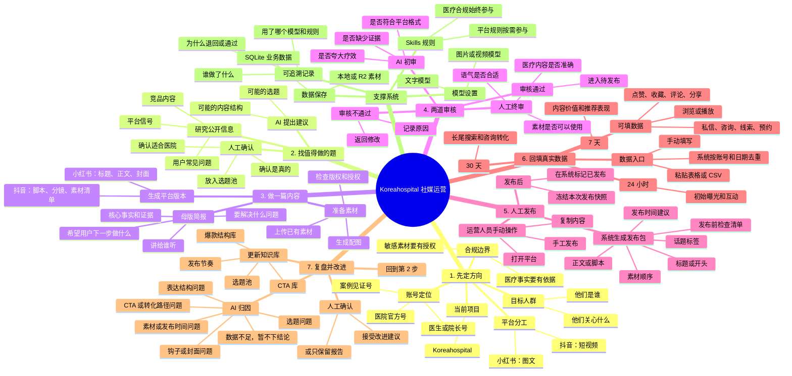

# Koreahospital 工作流程思维导图（小白版）

这份导图回答一个问题：一条社交媒体内容，如何从“想做什么”走到“发布后知道结果，并改进下一条”。

> 说明：这是项目规划的目标工作流。当前项目仍在持续实施中；页面或接口已经存在，不等于整条流程都已经完全打通。

## 一张图看懂主流程



## 小白版记忆口诀

**先定方向，后找题；先做母版，再做平台版本；AI 先检查，人最后拍板；发布靠人工，结果靠数据；复盘出建议，人确认后再沉淀。**

## 每一步到底要产出什么

| 阶段 | 你要完成的事 | 系统留下的结果 |
|---|---|---|
| 定方向 | 明确项目、人群、账号和平台分工 | 项目简报、账号定位、内容支柱 |
| 找选题 | 找公开信号，判断是否值得做 | 带来源的信号、已确认选题 |
| 做内容 | 先写共同事实，再改成平台版本 | 母版简报、小红书版本或抖音脚本 |
| 准备素材 | 找图、视频或生成配图，并检查授权 | 素材记录、授权状态、素材清单 |
| 审核 | AI 检查风险，人检查准确性和表达 | 审核结果、退回原因、批准记录 |
| 发布 | 复制发布包到平台并手动发布 | 已发布状态、发布版本快照 |
| 回填 | 在 24 小时、7 天、30 天补真实数据 | 内容数据、业务转化数据 |
| 复盘 | 根据数据判断哪里需要改进 | 归因报告、待确认回写建议 |

## 页面怎么找

可以把左侧导航理解为“工具箱”，但实际使用时建议按下面顺序走：

1. **项目 / 账号**：先看项目简报、平台和账号定位。
2. **信号 / 选题**：查看研究结果，把有依据的内容放入选题池。
3. **内容生产**：写母版简报，再生成小红书或抖音版本。
4. **素材库**：上传、挑选或生成内容所需素材。
5. **审核 / 发布**：先过 AI 审核，再人工批准；批准后手动复制发布。
6. **今日待发 / 排期**：查看今天要发布或要处理的内容。
7. **数据录入 / 数据看板 / 报表**：回填真实数据，观察表现。
8. **复盘 / 知识库**：确认改进建议，决定哪些经验保留下来。

## 三条必须记住的边界

### 1. AI 不是最终负责人

AI 可以研究、写作、生成素材、检查风险和提出复盘建议；但不能代替人工做最终医疗判断、最终发布批准或正式知识库写入。

### 2. 系统不会替你自动发布

发布包生成后，需要运营人员自己登录小红书或抖音，复制内容并发布。系统不自动登录、不自动发布、不自动评论点赞，也不保存平台密码。

### 3. 数据必须是真实数据

没有数据时可以标记“暂不下结论”，不要用猜测的数字填报。表格重复导入时，系统按“账号 + 日期”进行幂等处理，避免同一天数据重复计算。

## 一条内容的最短操作示例

```text
发现“脱发术后护理”是用户常问的问题
  ↓
人工确认：适合 Koreahospital，且有可靠医学依据
  ↓
建立母版简报：受众、事实、证据、目标
  ↓
分别生成小红书图文和抖音脚本
  ↓
准备素材 → AI 初审 → 人工终审
  ↓
复制发布包，人工发布
  ↓
24h / 7d / 30d 回填真实数据
  ↓
复盘：保留有效结构，改进下一条内容
```

相关的技术架构、数据表和接口细节，参见 [`ARCHITECTURE.md`](../ARCHITECTURE.md)；产品决策和实施阶段，参见 [`PRD-social-media-workbench.md`](./PRD-social-media-workbench.md)。
